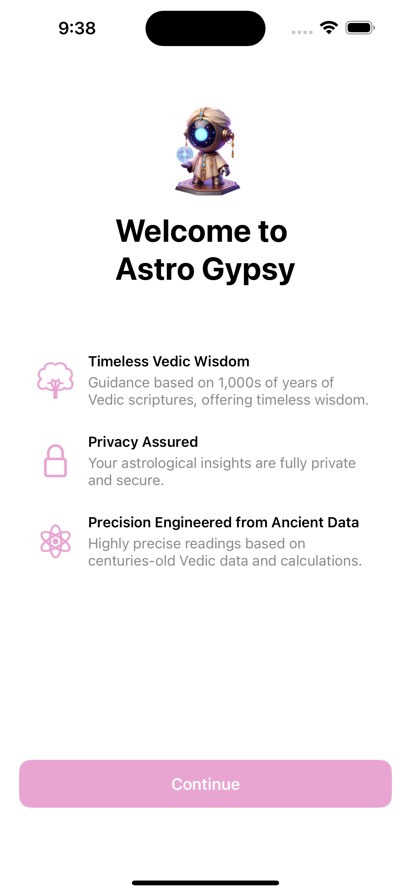
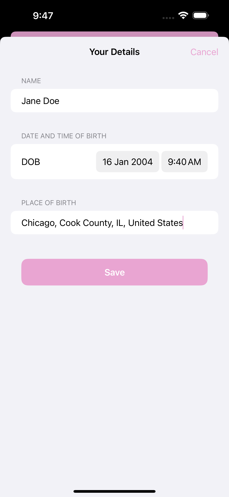
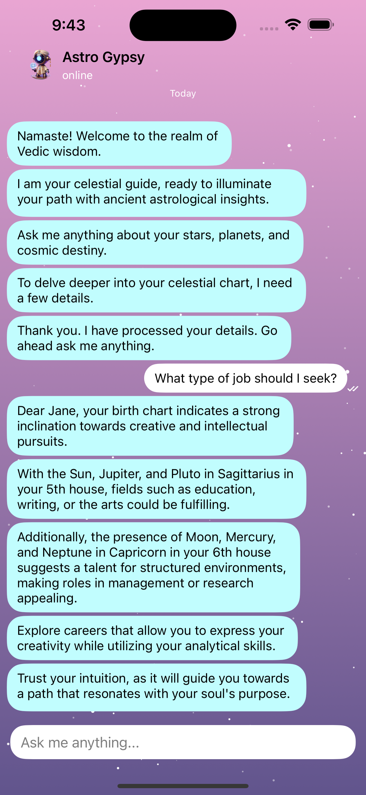

# 🌟 Astrology Chatbot

Welcome to the **Astrology Chatbot**, a mobile application built using **Flutter**. This chatbot provides astrological insights, daily horoscopes, zodiac compatibility, and personalized astrology readings over chat. The chatbot is powered by OpenAI's ChatGPT and offers an engaging, interactive user experience.

## 🚀 Features

- 💬 **Astrology Chatbot** – An AI-powered chatbot that answers astrology-related questions.
- 🔮 **Personalized Readings** – Get customized astrological predictions based on birth details.
- 🌙 **Daily Horoscope** – Get daily predictions based on your zodiac sign.
- 🎨 **Beautiful UI** – Smooth, responsive, and visually appealing Flutter UI.

## 📱 Screenshots

| Intro Screen | Birth Details | Chatbot |
|------------|--------|-----------|
|  |  |  |

## 💼 Contact & Purchase

If you’re interested in purchasing the source code, feel free to reach out:

📧 Email: [simpleapps14@gmail.com](mailto:simpleapps14@gmail.com)

Note that you will have to create a ChatGPT API Key.
